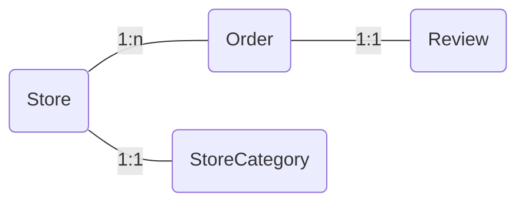

# Query DSL

## # 참고 자료

### 공식 홈페이지 : [Query DSL](http://querydsl.com/)

### Youtube : [Quertdsl with JPA](https://www.youtube.com/watch?v=Dz-46mPfkGo)

## # Query DSL 등장 배경

Spring Boot와 Spring Data JPA를 사용해서 프로젝트를 진행할 때 N+1문제와 같은 네임드 쿼리로 해결되지 않는 문제들은 기존에는 JPQL로 해결

```java
@Query("SELECT m" +              // 공백 누락
		"FROM Member m " +
		"JOIN FETCH m.team")
List<Crew> findAllWithTeam();    // 리턴 타입 불일치
```

위와 같은 내용은 테스트 코드가 없다면 실제 사용자가 해당 API로 요청을 할 때 런타임 에러로 발견

### -> DSL(Domain-Specific-Languages)이란

특정 도메인에서 발생하는 문제를 효과적으로 해결하기 위해 설계된 언어

예를 들어,

| Programming Language | Description                                                                      |
| -------------------- | -------------------------------------------------------------------------------- |
| SQL                  | 데이터베이스 내의 정보를 검색, 삽입, 수정, 삭제하기 위한 언어                    |
| CSS                  | 웹의 디자인, 레이아웃 및 시각적 스타일링을 정의하기 위한 언어                    |
| Regex                | 문자열 내에서 특정 패턴을 검색, 추출, 교체하기 위한 언어                         |
| Querydsl             | SQL 형식의 쿼리를 Type-Safe 하게 생성할 수 있도록 하는 DSL을 제공하는 라이브러리 |

<!--  -->


## # 설정 환경

| Tools         | Version  |
| ------------- | -------- |
| Spring Boot   | 3.1.4    |
| IntelliJ IDEA | 2023.2.2 |
| Gradel        | 8.2.1    |
| Querydsl      | 5.0.0    |

## # 예제 도메인




## # Querydsl 설정 방법

### 1. Querydsl - jpa 의존성 추가

<span style="color:red;font-weight:bold;">주의!!!</span>  
Spring Boot 3로 올라오면서 javax → jakarta로 변경됨  
즉, `:jakarta` 꼭 추가!!!

```java
// com.querydsl/querydsl-jpa
implementation 'com.querydsl:querydsl-jpa:5.0.0':jakarta
```

---

### 2. QClass 생성을 위한 annotationProcessor 추가

**QClass**란 엔티티 클래스 속성과 구조를 설명해주는 메타데이터  
→ 위 메타데이터를 이용해서 Type-Safe하게 쿼리 조건 설정 가능

```java
// com.querydsl/querydsl-apt
implementation 'com.querydsl:querydsl-apt:${dependencyManagement.importedProperties['querydsl.version']}:jakarta'

// jakarta.annotation/jakarta.annotation-api
implementation 'jakarta.annotation:jakarta.annotation-api'

// jakarta.persistence/jakarta.persistence-api
implementation 'jakarta.persistence:jakarta.persistence-api'
```

```java
// Member.java

@Entity
@Getter
@Setter
public class Member {
  @Id
  @GeneratedValue(strategy = GenerationType.IDENTITY)
  private Long id;
  private String username;
  private int age;
  @ManyToOne(fetch = FetchType.LAZY)
  private Team team; // 연관참조 관계

  ...
}
```

**annotationProcessor를 통해 생성된 QClass ⬇️**

```java
@Generated("com.querydsl.codegen.DefaultEntitySerializer")
public class QMember extends EntityPathBase<Member> {
  private static final long serialVersionUID = 324647761L;
  private static final PathInits INITS = PathInits.DIRECT2;

// Member 필드에 작성된 id, username, age
  public final NumberPath<Long> id = createNumber("id", Long.class);
  public final StringPath username = createString("username");
  public final NumberPath<Integer> age = createNumber("age", Integer.class);
// Member 필드에 작성된 team
  public final  QTeam team;


// 자기자신을 static으로 생성
// => 추후 alias로 사용
  public static final QMember member = new QMember("member1");

  public QMember(String variable) {
    this(Member.class, forVariable(variable), INITS);
  }

...

}
```

---

### 3. 협업을 위한 gradle script 추가

#### - Querydsl 설정 방법

```java
// Error
import static com.querydsl.jpa.JPAExpressions.select;
import static study.querydsl.domain.order.QOrder.order;
import static study.querydsl.domain.order.QOrderMenu.orderMenu;
import static study.querydsl.domain.review.QReview.review;
import static study.querydsl.domain.store.QStore.store;
```

#### - 주의사항

    Gradle 설정 ) build > generated > … > QClass 생성됨
    IntelliJ 설정 ) src > main > generated > … > QClass 생성됨

위 내용처럼 각 빌드툴에 따라 폴더의 생성 위치가 달라질 수 있기 때문

```java
def generated = 'src/main/generated'

// querydsl QClass 파일 생성 위치를 지정
task.withType(JavaCompile.configureEach{
	options.getGeneratedSourceOutputDirectory().set(file(generated))
}

// gradle clean 시에 QClass 디렉토리 삭제
clean {
	delete file(generated)
}
```

---

### 4. .gitignore 등록

Querydsl 라이브러리 버전에 따라서 생성되는 QClass 생김새가 달라질 수 있다.

```java
// .gitignore

### Querydsl ###
/src/main/generated/
```

## # JpaRepository와 함께 사용하기

### 1. 사용할 JPA 레포지토리 선언

```java
public interface StoreRepository extends JpaRepository<Store, Long> {}
```

---

### 2. JPAQueryFactory 빈 등록

Querydsl은 JPA를 통해서 엔티티를 조회하기 때문에 `EntityManager` 가 필수로 필요함

```java
@Configuration
public class QueryDslConfig {
	@PersistenceContext
	private EntityManager entityManager;

	@Bean
	public JPAQueryFactory jpaQueryFactory() {
		return new JPAQueryFactory(entityManager);
	}
}
```

---

### 3. CustomerRepository 인터페이스 생성

Querydsl로 수행할 메서드를 선언

```java
public interface CustomerRepository {
	List<PopularStoreDto> findPopularStoreThan(final long id);

	public List<Store> findStoreByStoreCategoryByPaging(
        final StroreCategory stroreCategory,
        final Long offset, final Long size);
}
```

---

### 4. CustomerRepositoryImpl 클래스 구현

- 꼭! 인터페이스 이름 뒤 Impl을 붙여서 작성
- postfix를 붙어서 Querydsl코드 구현

```java
@RequiredArgsConstrructor
public class CustomerRepositoryImpl implements CustomerRepository {
  @Override
  public List<PopularStoreDto> findPopularStoreThan(long id) {
    return /* querydsl 코드*/
  }

  @Override
  public List<Store> findStoreByStoreCategoryByPaging(StroreCategory stroreCategory, Long offset, Long size) {
    return /* querydsl 코드*/
  }
}
```

---

### 5. 1번에 사용할 JPA 레포지토리 수정

```java
public interface StoreRepository extends JpaRepository<Store, Long>, CustomerStoreRepository {}
```

## # 조회

### Q : 특정 카테코리에 포함된 모든 가게를 조회해주세요!

```java
// Querydsl로 구현

@Override
public List<Store> findStoreByStoreCategory(final StroreCategory stroreCategory) {
	return jpaQueryFactory
				.select(store) // QClass 또는 QClass의 들어있는 필드 주입
				.from(store)   // QClass를 조회할 위치
				// # 만약 두개가 동일하다면
				//  .selectFrom(store)로 표현 가능

				.where(store.storeCategory.eq(storeCategory))
				.fetch();
}
```

#### - 조건절

```java
// # where 절에 조건을 부여할 떄,

store.storeName.eq("store1")  // equal
store.storeName.ne("store1")  // not equal
store.storeName.eq("store1").not()
store.storeName.isNotNull()

store.id.in(0, 10)
store.id.notIn(0, 10)
store.id.between(0, 10)
store.id.goe(10)          // >=
store.id.gt(10)           // >
store.id.loe(10)          // <=
store.id.lt(10)           // <

store.storeName.like("store%")
store.storeName.contains("store")    // like "%value%"
store.storeName.startswith("store")  // like "value%"
```

#### - 결과 조회

```java
// # 결과를 조회할 때,

.fetchOne()    // return Store
							 // - 0 => null
							 // - !1 => Exception

.fetch()        // return List<Store>
.fetchFirst()   // limit(1).fetchOne()
.fetchResults() // 페이징
.fetchCount()   // 카운드
```

---

### Q : 특정 카테코리에 포함된 모든 가게를

### 리뷰가 높은 순으로 정렬해서 조회해주세요!

```java
// Querydsl로 구현

@Override
public List<Store> findStoreByStoreCategory(final StroreCategory stroreCategory) {
	return jpaQueryFactory
				// # 집계함수는 select, groupBy절 등 다양한 곳에서 사용가능
				.select(store)
				.from(store)

				.leftJoin(store.orders, order)
				.leftJoin(order.review, review)
				// # N+1 문제 해결 하려면
				//  .leftJoin(store.orders, order)
				//  .fetchJoin()
				//  .leftJoin(store.review, review)
				//  .fetchJoin()

				.where(store.storeCategory.eq(storeCategory))
				.groupBy(store)
				.orderBy(review.rate.sum().desc())
				.fetch();
```

#### - 조인

```java
// # 조인하는 방법

.innerJoin(order.review, review)
.on(review.content.contains("맛있어요"))

.join(order.review, review)
.on(review.content.contains("맛있어요"))

.join(order.review, review)
.where(review.content.contains("맛있어요")) // 좀 더 가독성 있음

.leftJoin(order.review, review)
.on(review.content.contains("맛있어요"))

.rightJoin(order.review, review)
.on(review.content.contains("맛있어요"))

// 만약 연관관계가 없는 테이블을 조회한다면,
// # inner join인 경우
.join(order, review)
.where(order.review.eq(review.content))
// 연관관계가 없는 테이블간의 조인은 카테시안 곱이 발생함으로 주의!!

// # outer join인 경우
.from(order)
.leftJoin(review)
.on(order.review.content.eq(review.content))
// 연관관계가 없는 테이블 간 외부 조인은 조인메서드에 하나의 QClass만 명

// # N+1 문제 해결 하려면
.leftJoin(store.orders, order)
.fetchJoin()
// 2개 이상의 OneToMany 관계는 연속된 fetchJoin이 안됨
// -> querydsl이 아닌 jpql의 특징
.leftJoin(store.orders, order)
.fetchJoin()
.leftJoin(store.review, review)
.fetchJoin()
```

#### - 정렬 및 그룹핑

```java
// # orderBy는 정렬하고 싶은 조건
.orderBy(review.rate.sum().desc())

.orderBy(review.rate.avg().asc())

// # outer join에서 발생할 수 있는 null값의 위치를 지정
.orderBy(review.fate.count().desc().nullsLast())
.orderBy(review.fate.count().desc().nullsFirst())


// # groupBy는 그룹핑하고 싶은 조건
```

---

### Q : 서비스에 등록된 가게가 너무 많아요!

### 특정 카테고리에 포함된 가게를 10개씩 페이지네이션하고

### 리뷰가 높은 순으로 정렬해서 조회해주세요!

```java
// Querydsl로 구현

@Override
public List<Store> findStoreByStoreCategory(final StroreCategory stroreCategory,
																						final Long offset, final Long size) {
	return jpaQueryFactory
				.select(store)
				.from(store)
				.leftJoin(store.orders, order)
				.leftJoin(order.review, review)
				.where(store.storeCategory.eq(storeCategory))
				.groupBy(store)
				.orderBy(review.rate.sum().desc())
				.offset(offset)
				.limit(size)
				.fetch();
```

## # 서브쿼리 작성방법

Querydsl이 서브쿼리를 작성하기 위해 제공하는 것

### 1. JPAQuery

- 일반적으로 사용하는 쿼리문 생성
- 사용 범위가 넓음  
  EX ) .select()

### 2. JPAExpressions

- 공식문서에서 서브쿼리 작성 시 위 기술을 권장함
- 유틸성 클래스
- 다양한 select 메서드 지원
- 사용 범위가 서브 쿼리에 더 맞춰져 있음  
  EX ) .select() / .selectFrom() / .selectDistinct() / .selectOne() / .selectZero() / …

### Q : 전체 리뷰 평균 별점보다 평점이 높은 가게만 골라서

### 평점순으로 조회해주세요!

```java
// 요구사항 1 ) 가게 상관없이 전체 리뷰 평점을 계산함

final QReview notJoinedReview = new QReview("review2");

JPAExpressions
			.select(notJoinedReview.rate.avg())
			.from(notJoinedReview);


// 요구사항 2 ) 전체 리뷰 평점보다 가게의 평점이 크거나 같은 가게만 필터링

having(review.rate.avg().goe( // 크거나 같음
		JPAExpressions
			.select(notJoinedReview.rate.avg())
			.from(notJoinedReview);
	)
)
```

**다시 말해서,**

가게에 상관없이 계산된 전체 리뷰 평점보다

특정 가게의 모든 주문의 리뷰 평점이 높은 가게만 골라서

평점 순으로 조회해주세요!

#### - SQL로 표현

```sql
SELECT s AS store, AVG(r.rate) AS totalRate
FROM Store s
LEFT JOIN s.orders o
LEFT JOINo.review r
GROUP BY s.id
HAVING AVG(r.rate) >= (
	SELECT AVG(r1.rate) FROM Review r1)
ORDER BY AVG(r.rate) DESC, s.id DESC
```

#### - Querydsl로 표현

```java
// Querydsl로 구현

public List<QueryDslPopularStoreWithTotalRateDto> findPopularStoreByTotalRate() {
	final QReview notJoinedReview = new QReview("review2");

	return jpaQueryFactory
				.select(
					Projections.fields(
						// 가게, 가게의 평점 조회
					)
	        .from(store)
	        .leftJoin(store.orders, order)

					// # review1
	        .leftJoin(order.review, review)
	        .groupBy(store.id)


					// "전체 리뷰 평점보다 평점이 더 크거나 같은 가게만" 조건 필터링 필요
					// # review2
	        .having(review.rate.avg().goe( // depth가 깊어져 가독성이 떨어짐
						JPAExpressions
							.select(notJoinedReview.rate.avg())
							.from(notJoinedReview);
						)
					// # 메서드로 분리할 때,
					//  .having(review.rate.avg().goe(calculateTotalRateAvg()))

					)
	        .orderBy(review.rate.avg().desc(), store.id.desc())
	        .fetch();
}
```

#### - 메서드 분리

```java
public JPQLQuery<Double> calculateTotalRateAvg() {
	final QReview notJoinedReview = new QReview("review2");

return review.rate.avg().goe(
	JPAExpressions.select(notJoinedReview.rate.avg())
								.from(notJoinedReview)
	);
}
```

---

### Q : 왜 전체 평점을 계산하기 위해 새로운 QClass Review를 생성해야할까요?

- 서로 다른 목적의 Review를 구분
  review1 → 가게와 전혀 상관없이 리뷰에대한 전체 평점을 계산
  review2 → order와 join이 됨. 즉, 비교하고 싶은 대상
- 메인 쿼리와 서브 쿼리 사이의 별칭 충돌 방지
  EX ) 동일한 review에 대해 같거나 큼을 비교함 → 의도와 다른 쿼리

## # 동적 쿼리 & 동적 정렬

전달된 요청에 따라 쿼리에 변화하는 것

### 1. BooleanExpression

- 조건을 나타내는 부분에 들어가는 참/거짓 표현
- null 값이 반환되면 자동으로 조건에서 무시( 메서드 분리 가능 )

```java
.from(store)
.where(expression1, expression2)

private BooleanExpression expression1(final String name) {
	if(name == null) {
		return null;
	}
	return /* null이 아닌 expression */
}

private BooleanExpression expression2(final String name) {
	return /* null이 아닌 expression */
}
```

---

### Q : 가게 평점순, 주문순 중 선택해서 조회하고 싶어요!

### 제가 원하는 기준 이상의 가게들만 조회하게 해주세요!

| 조건 필수 선택 | 원하는 기준값 자유                                 |
| -------------- | -------------------------------------------------- |
| [ ]평점순      | [ ]최소값 <span style="color:gray"> ex - 10</span> |
| [ ]주문순      | [ ]미지정<span style="color:gray"> 필터링 x</span> |

#### -> 추가된 요구사항 분석

1. 기준이 주문순인지, 평점순인지에 따라 계산식, 정렬 순서가 달라진다.
2. 기준이 되는 최소값의 선택 여부에 따라 가게들의 필터링 여부가 결정된다.

```java
// # Querydsl이 제공하는 클래스 사용

public OrderSpecifier(Order order, Expression<T> target) {
	this(order, target, NullHanling.Default);
	// Order : ASC, DESC enum 클래스
	// Target : 정렬 기준이 되는 QClass 필드
	// OrderSpecifier[] : 여러 정렬 조건을 순서대로 순차 정렬(배열로 표현o)
}


// # Pageable의 정렬인 Sort를 사용하여 동적이 OrderSpecifier 생성
	// 주문순 정렬, 주문수가 같은 경우 store의 id순 정렬
	Sort.by(Direction.DESC, "orderCount", "id")
	// 평점순 정렬, 평점수가 같은 경우 store의 id순 정렬
	Sort.by(Direction.DESC, "rate", "id")
```

**다시 말해서,**

가게를 평점순, 주문순 중 선택해서 조회하고 싶어요!

만약 평점, 주문수가 같다면 가장 최근에 생긴 가게부터 보여주세요.

그리고 가게가 너무 많아서

제가 원하는 값 이상의 가게들만 조회할 수 있게 해주시면 안될까요?

#### - sudo 코드로 표현

```sudo
// sudo 코드

if(정렬 기준 == 주문순) {
	정렬 조건: 주문순 내림차순으로 변경
	if(최소값 != null) {
		가게 필터링 조건: 가게의 총 주문수 >= 최소값
	}
	if(최소값 == null) {
		최소값 조건을 걸지 않는다.
	}
}
else if(정렬 기준 == 평점순) {
	정렬 조건: 평점순 내림차순으로 변경
	if(최소값 != null) {
		가게 필터링 조건: 가게의 리뷰 평점 >= 최소값
	}
	if(최소값 == null) {
		최소값 조건을 걸지 않는다.
	}
}
```

#### - Querydsl로 표현

```java
// Querydsl로 구현

public List<Store> findPopularStoreByTotalRateOrOrderWithMin(final String type, final String min) {
	return jpaQueryFactory
				.selectForm(store)
	      .leftJoin(store.orders, order)
	      .leftJoin(order.review, review)
	      .groupBy(store.id)

				// 전체 리뷰 평점보다 평점이 더 크거나 같은 가게
				.having(matchesCondition(getTypeFormSort(sort), min))

				// # 동적 쿼리 적용 x
				// .orderBy(review.rate.avg().desc(), store.id.desc())
				// # 동적 쿼리 적용 o
				// type이 "orderCount"면 주문순 정렬, "rate"면 평점순 정렬
				.orderBy(getSortCondition(sort))

				.fetch();
}

// 메소드의 역할, 필터링의 조건 등이 들어나게 이름을
private BooleanExpression matchesCondition(final String type, final String min) {
	if(type.equals("orderCount")) {
		return filterByOrderCount(min);
	}
	if(type.equals("rate")) {
		return filterByRate(min);
	}
return null;
}

// 배열에 담긴 순서대로 순차 정렬
private OrderSpecifier[] getSortCondition(final Sort sort) {
	final List<OrderSpecifier> orders = new ArrayList<>();

	// Sort가 비어있는 상황을 대비하여 기본 정렬로 store.id 추가
	if(sort.isEmpty()) {
		return new OrderSpecifier[]{new OrderSpecifier(DESC, store.id)};
	}


// ***
	for(final Sort.Order sortOrder : sort) {
		addOrderSpecifierByCurrentSortCondition(sortOrder, orders);
	}
// ***
	return orders.toArray(new OrderSpecifier[0]);
}

private void addOrderSpecifierByCurrentSortCondition(final Sort.Order sortOrder,
																					final List<OrderSpecifier> specifiers) {

// ASC, DESC 여부 판단을 통해 정렬 방향 결정
com.querydsl.core.types.Order direction = DESC;
	if(sortOrder.isAscending()) {
		direction = ASC;
	}

// 위 OrderSpecifier 메서드에서
	final Sting orderTarget = sortOrder.getProperty();
	if(orderTarget.equals("orderCount")) {
		specifiers.add(new OrderSpecifier(direction, order.count()));
		return;
	}
	if(orderTarget.equals("rate")) {
		specifiers.add(new OrderSpecifier(direction, review.rate.avg()));
		return;
	}
	if(orderTarget.equals("id")) {
		specifiers.add(new OrderSpecifier(direction, order.store.id));
		return;
	}
}
```

## # 장점

- 가독성 향상, 메서드 네이밍을 통해 쿼리 조건, 정렬 방식 유추 가능
- 메서드 분리를 통한 재사용성 향상
- Type-safe한 QClass를 통한 문법으로 인한 런타임 에러 방지  
  → 필드를 잘못 작성해서 생기는 오류는 거의 없음

## # 주의할 점

- 1차 캐시 장점을 누릴 수 없음(JPQL의 특징)
  Querydsl을 실행시키면 JPQL로 변환되어 DB로 보냄
  즉, Querydsl은 Type-safe한 JPQL 빌더임
- JAVA 8기준임
- 많은 기능(조건 필터링, 조회 크기, 범위 지정, 정렬, 그룹화 등)을 한줄로 처리하기에 비즈니스로직이 들어갈 위험이 있음
