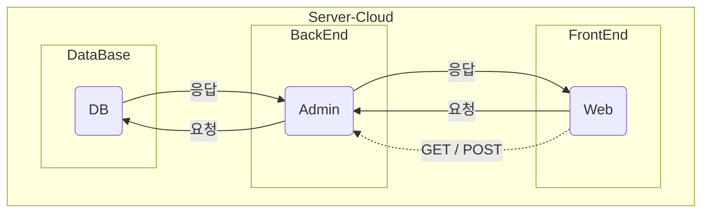

# HTML

## # 참고 자료

## # HTML 구조

```html
<!-- HTML 5 통합 버전 -->
<!DOCTYPE html>
<html>
  <!-- 웹 페이지 범위 -->
  <head>
    <!--
        사용자에게 실제로 보여지는 부분 X
        각종 설정, 디자인(CSS), 추가 기능(JS)
    -->
    <meta charset="UTF-8" />
    <meta http-equiv="X-UA-Compatible" content="IE=edge" />
    <meta name="viewport" content="width=device-width, initial-scale=1.0" />
    <title>Document</title>
  </head>
  <body>
    <!-- 
        실제로 페이지로 보여지는 부분
    -->
  </body>
</html>
```

## # HTML 특성

- 태그를 사용할 때 <, > 사용
- 태그를 쓸 때, 대문자를 써도 상관없으나 통일성을 위해 소문자 사용을 권장
- 태그를 열었으면 반드시 닫아줘야 함(단일태그 : 닫는 태그가 없는 태그도 존재)
- 적당한 들여쓰기를 권장(내부에 존재하는 태그를 쉽게 확인하기 위해)
- 세부적인 조절을 위해 태그 내에 속성을 포함 가능
- 태그 간 포함 관계를 명확하게 함  
   ex - O ) `<p><i> ... </i></p>`  
   ex - X ) `<i><p> ... </p></i>`

## # HTML 태그

### 1. 주석

- 코드 동작을 비활성화
- 코드가 동작하지 않도록 설정
- 설명을 작성하고 싶을 때 사용
- [ Ctrl ] + [ / ]

### 2. `<head>`태그

```html
<head>
  <!--
        <meta> 태그
            - 단일 태그이며 설정할 떄 사용
            - 속성
                charset : UTF-8(페이지를 국제 표준으로 보여주겠다는 의미)
        <title> 태그
            - 브라우저에서 표출되는 탭 제목 지정
    -->
  <meta charset="UTF-8" />
  <meta http-equiv="X-UA-Compatible" content="IE=edge" />
  <meta name="viewport" content="width=device-width, initial-scale=1.0" />
  <title>탭 제목</title>
</head>
```

### 3. `<body>`태그

#### Text\_ `<h숫자>`, `<p>`, `<br>`, `<hr>`, `<pre>`

```html
<!-- 
    <h> 태그
        - 1~6 범위 내 제목을 지정하는 태그
 -->
<h1>대 제목</h1>
<h2>중 제목</h2>
<h3>소 제목</h3>

<!-- 
    <p> 태그
        - 일반 텍스트 태그

    <br> 태그( 단일 태그 )
        - 줄을 수동으로 변경
    
    <hr> 태그( 단일 태그 )
        - 분위기 전환을 위한 줄 긋기
-->
<p>일반<br />텍스트</p>
<hr />

<!-- 
    <pre> 태그
        - 줄바꿈, 띄어쓰기 전부 반영
 -->
<pre>
    안녕하세요.
    java
</pre>
```

#### Text\_ `<b>`, `<strong>`, `<i>`, `<em>`, `<span>`, `<mark>`

```html
<p>강조</p>
<!-- 
    <b> 태그
        - 글자를 굵게 지정
        - 음성으로 지원 시 강조 X( 배리어프리기술 적용 X )

    <strong> 태그
        - 글자를 굵게 지정
        - 음성으로 지원 시 강조 O( 배리어프리기술 적용 O )
 -->
<p><b>강조</b></p>
<p><strong>강조</strong></p>

<!-- 
    <i> 태그
        - 글자를 기울임
        - 음성으로 지원 시 강조 X( 배리어프리기술 적용 X )  
    <em>
        - 글자를 기울임
        - 음성으로 지원 시 강조 O( 배리어프리기술 적용 O )
 -->
<p><i>기울임</i></p>
<p><em>기울임</em></p>

<!-- 
    <span> 태그
        - 글자를 묶어주는 역할
        - 부분마다 디자인 적용 시 사용
 -->
<p><span>일반</span>텍스트</p>
<p><span style="color: blue;">일반</span>텍스트</p>

<!-- 
   <mark> 태그
       - 형광펜 효과
 -->
<p><mark>형광펜</mark> 효과</p>
```

#### List\_ `<ul>`, `<ol>`, `<li>`

```html
<!-- 
    <ul> 태그
        - 순서가 없는 목록으로 내용은 <li>태그로 작성
 -->
<h1>순서가 없는 목록</h1>
<ul>
  <li>목록1</li>
  <li>목록2</li>
  <li>목록3</li>
</ul>

<!-- 
    <ol> 태그
        - 순서가 있는 목록으로 내용은 <li>태그로 작성
 -->
<h1>순서가 있는 목록</h1>
<ol>
  <li></li>
</ol>
```

#### Table\_ `<table>`,`<tr>`, `<td>`, `<th>`

|         | 4열(td) | ➡️  | ➡️  | ➡️  |
| ------- | ------- | --- | --- | --- |
| 3행(tr) | 1       | 2   | 3   | 4   |
| ⬇️      | 5       | 6   | 7   | 8   |
| ⬇️      | 9       | 10  | 11  | 12  |

```html
<table border="1px">
  <tr>
    <th>1</th>
    <th>2</th>
    <th>3</th>
    <th>4</th>
  </tr>
  <tr>
    <th>5</th>
    <td>6</td>
    <td>7</td>
    <td>8</td>
  </tr>
  <tr>
    <th>9</th>
    <td>10</td>
    <td>11</td>
    <td>12</td>
  </tr>
</table>
```

#### Table\_ `<caption>`,`<thead>`, `<tbody>`, `<tfoot>`

<!--  -->


```html
<table border="1">
  <caption>
    요안도라 객실
  </caption>

  <thead>
    <tr>
      <th>방 이름</th>
      <th>대상</th>
      <th>크기</th>
      <th>가격</th>
    </tr>
  </thead>

  <tbody>
    <tr>
      <th>유채방</th>
      <td>여성 도미토리</td>
      <td rowspan="3">4인실</td>
      <td rowspan="4">1인 20,000원</td>
    </tr>
    <tr>
      <th rowspan="2">동백방</th>
      <td>동성 도미토리</td>
    </tr>
    <tr>
      <td>가족 1팀</td>
    </tr>
    <tr>
      <th>천혜향방</th>
      <td>-</td>
      <td>2인실</td>
    </tr>
  </tbody>

  <tfoot>
    <tr>
      <th colspan="4">바깥체 전체를 렌트합니다</th>
    </tr>
  </tfoot>
</table>
```

#### Image\_ ``

<!--  -->


```html
<!-- 
     태그
        - 이미지를 웹 페이지에 추가
        - jpg or jpeg, gif, png 형식의 이미지 사용 가능
        - 직접 입력 or 인터넷 상에서 이미지 주소 복사 입력 가능
        - 속성
            alt   : 사진의 부가 설명
                  : 음성으로 지원 O ( 배리어프리기술 적용 O )
            style : CSS 속성 추가
                  : (ex) 가로 길이(width), 세로 길이(height)  
 -->
<!-- 직접 입력 -->


<!-- 인터넷 이미지 주소 복사 입력 -->

```

#### Link\_ `<a>`

<!--  -->

```html
<head>
    <meta charset="UTF-8">
    <title>Link</title>
    <style>
        a {
            /* 밑줄 제거 */
            text-decoration: none;
            /* 글자색 -> black */
            color: black;
        }
    </style>
</head>
<body>
    <!-- 
        <a> 태그
            - 다른 페이지로 이동(링크)
            - img 태그를 이용하여 사진으로 원하는 링크 이동 가능
            - 속성
                href   : 이동할 경로를 지정
                target : 기존 탭 변경(_self), 새 탭 생성(_blank)
     -->
    <a href="https://www.naver.com/" target="_self">네이버</a>

    <a href="https://www.naver.com/" target="_blank">
        
    </a>

</body>
```

#### Link\_ `<a>`\_anchor

<!--  -->


```html
<h1 id="menu">목차</h1>
<ul>
  <li><a href="#content1">메뉴1</a></li>
  <li><a href="#content2">메뉴2</a></li>
  <li><a href="#content3">메뉴3</a></li>
</ul>

<h2 id="content1">내용1</h2>
<p>1</p>
<p>1</p>
<p>1</p>
<p>1</p>
<p>1</p>
<p>1</p>
<p>1</p>
<p>1</p>
<p>1</p>
<p>1</p>
<p>1</p>
<p>1</p>
<p>1</p>
<p>1</p>
<p>1</p>
<p>1</p>

<h2 id="content2">내용2</h2>
<p>2</p>
<p>2</p>
<p>2</p>
<p>2</p>
<p>2</p>
<p>2</p>
<p>2</p>
<p>2</p>
<p>2</p>
<p>2</p>
<p>2</p>
<p>2</p>
<p>2</p>
<p>2</p>
<p>2</p>
<p>2</p>

<h2 id="content3">내용3</h2>
<p>3</p>
<p>3</p>
<p>3</p>
<p>3</p>
<p>3</p>
<p>3</p>
<p>3</p>
<p>3</p>
<p>3</p>
<p>3</p>
<p>3</p>
<p>3</p>
<p>3</p>
<p>3</p>
<p>3</p>
<p>3</p>

<h3><a href="#menu">메뉴로</a></h3>
```

### 4. 프로그램 구성



#### Form\_ `<form>`,`<input>`,`<label>`, `<Fieldset>`, `<Legend>`

: 입력한 내용을 프론트엔드에서 백엔드로 전달할 경우 사용하는 태그

**GET**

- 입력한 내용의 보안이 필요없는 경우( 단순 검색, … )
- 입력 내용이 URL 주소창에 공개됨
- 데이터를 백엔드가 받아서 새로운 페이지로 열어줌( DB에 접근할 필요 X )

  **POST**

- 입력한 정보에 보안이 필요할 경우(게시판, 로그인, …)
- 입력한 내용이 공개되지 않음
- 백엔드가 해당 데이터를 프론트엔드에서 받아서 DB에 있는 데이터와 비교 O

<!--  -->


```html
<!-- 
    <form> 태그
        - 백엔트에게 데이터를 넘겨줄 떄 사용
        - <input> 태그 내용을 종합해서 백엔드로 전달
        - <input> 태그를 제외한 다른 태그의 정보는 전달 X
        - 속성
            method : 백엔드에 데이터를 전달하는 방식 지정(get / post)
            action : 해당 데이터를 처리해줄 프로그램(파일명.파일형식) 지정

    <input> 태그( 단일 태그 )
        - 속성
            text   : 
            submit : 
            value  : 값을 지정하지 않는다면 기본으로 "제출"이 사용됨
 -->
<form method="post" action="test.php">
  <input type="text" />
  <input type="submit" value="검색" />
</form>
```

<!--  -->


```html
<head>
  <meta charset="UTF-8" />
  <title>Label</title>
  <style>
    ul {
      list-style: none;
    }
  </style>
</head>
<body>
  <form action="login.jsp" method="post">
    <!-- 
            <label> 태그
                - 인라인 레벨 요소이기 때문에 한 줄로 작성됨
                - 텍스트와 입력창을 한 줄로 표현할 떄 주로 사용
                - 속성
                    for : <input> 태그의 id를 작성해서 연결

            # 줄바꿈을 하고 싶은 경우 사용
                <p>아이디</p>
                <input type="text">
         -->

    <ul>
      <li>
        <!-- 경우 1 : CSS 적용 X -->
        <label for=""
          >아이디
          <input type="text" />
        </label>
      </li>
      <li>
        <!-- 경우 2 : CSS 적용 O -->
        <label for="pw">비밀번호</label>
        <input type="password" id="pw" />
      </li>
      <li>
        <input type="submit" value="로그인" />
      </li>
    </ul>
  </form>
</body>
```

<!--  -->


```html
<head>
  <meta charset="UTF-8" />
  <title>Fieldset, Legend</title>
  <style>
    ul {
      list-style: none;
    }
  </style>
</head>
<body>
  <form action="login.jsp" method="post">
    <!-- 
            <label> 태그
                - 인라인 레벨 요소이기 때문에 한 줄로 작성됨
                - 텍스트와 입력창을 한 줄로 표현할 떄 주로 사용
                - 속성
                    for : <input> 태그의 id를 작성해서 연결

            # 줄바꿈을 하고 싶은 경우 사용
                <p>아이디</p>
                <input type="text">

            <fieldset> 태그
                - 항목을 개별적인 선으로 구분 짓기 가능
            
            <legend> 태그
                - <fieldset> 태그랑 짝궁ㅋㅋ
                - 항목 제목 작성
         -->

    <ul>
      <fieldset>
        <legend>로그인 정보</legend>
        <li>
          <!-- 경우 1 : CSS 적용 X -->
          <label for=""
            >아이디
            <input type="text" />
          </label>
        </li>
        <li>
          <!-- 경우 2 : CSS 적용 O -->
          <label for="pw">비밀번호</label>
          <input type="password" id="pw" />
        </li>
      </fieldset>

      <li>
        <input type="submit" value="로그인" />
      </li>
    </ul>
  </form>
</body>
```

#### Input\_ `<input>`

<!--  -->


```html
<!--
    <input> 태그
        - 입력과 관련된 태그
        - 속성
            type        : 입력받을 형식을 지정
                > text     : 한 줄 텍스트를 입력
                > search   : 검색 상자(입력창 맨 끝 x 표시)
                > tel      : 전화 번호 입력(text와 차이는 없지만 숫자로 인식함, 전화번호는 국제표준 X)
                > url      : URL 주소 입력("http://" or "https://"를 입력해야함)
                > email    : 이메일 주소 입력("@" 텍스트 안에 반드시 존재해야함)
                > password : 비밀번호 입력(입력값이 "*"로 출력됨)
                > number   : 숫자 입력(입력창 맨 끝 스핀박스(위아래 화살표) 표시)
                           : 최댓값(max), 최소값(min), 기본값(value), 증감값(step)
                > checkbox : 사각형으로 된 선택 박스(복수 선택 시 사용)
                           : 그룹명 다르게 지정(name)
                > radio    : 원형으로 된 선택 박스(단일 선택 시 사용)
                           : 그룹명 같게 지정(name)
                > file     : 파일 업로드 기능
                > submit   : 같은 <form> 태그 내 <input>입력 내용을 종합해서 전송
                > reset    : 같은 <form> 태그 내 <input>입력 내용을 모두 초기화
                > button   : 단순 버튼(기능 추가 가능)

            autofocus   : 시작 시 자동으로 첫 입력부분으로 커서 이동
            placeholder : 입력해야할 정보를 임시로 표시
            readonly    : 입력해야할 정보에 대한 힌트 제공
            required    : 수정할 수 없는 항목
            size, maxlength, minlength : 글자 길이 제한
-->
<form action="test.php">
  <ul>
    <li>
      <label for="uid">아이디</label>
      <input type="text" id="uid" />
    </li>
    <li>
      <label for="upw">비밀번호</label>
      <input type="password" id="upw" />
    </li>
    <li>
      <input type="submit" />
    </li>
  </ul>
</form>
```

<p align="left">
<!--  -->

<!--  -->

<!--  -->

</p>

```html
<form action="test.php">
  <ul>
    <li>
      <label for="sc">검색상자</label>
      <input type="search" id="sc" />
    </li>
    <li>
      <label for="phone">전화번호</label>
      <input type="tel" id="phone" />
    </li>
    <li>
      <label for="homep">홈페이지</label>
      <input type="url" id="homep" />
    </li>
    <li>
      <label for="mail">이메일</label>
      <input type="email" id="mail" />
    </li>
    <li>
      <label for="num">숫자박스</label>
      <input type="number" id="num" min="0" max="15" value="5" step="2" />
    </li>
    <li>
      <input type="submit" />
    </li>
  </ul>
</form>
```

<!--  -->


```html
<form action="test.php">
  <ul>
    <li>
      <h2>난이도</h2>
      <label for="test1">상</label>
      <input type="radio" id="test1" name="t" />
      <label for="test2">중</label>
      <input type="radio" id="test2" name="t" />
      <label for="test3">하</label>
      <input type="radio" id="test3" name="t" />
    </li>
    <li>
      <h2>과목</h2>
      <label for="kor">국어</label>
      <input type="checkbox" id="kor" name="k" />
      <label for="eng">영어</label>
      <input type="checkbox" id="eng" name="e" />
      <label for="math">수학</label>
      <input type="checkbox" id="math" name="m" />
    </li>
  </ul>
</form>
```

<!--  -->


```html
<form action="test.php">
  <ul>
    <li>
      <label for="up">업로드</label>
      <input type="file" id="up" />
    </li>
    <li>
      <label for="upw">비밀번호</label>
      <input type="password" id="upw" />
    </li>
    <li>
      <input type="submit" />
      <input type="reset" value="리셋" />

      <input type="button" value="새 창 열기" onclick="window.open()" />
    </li>
  </ul>
</form>
```

<!--  -->

<!--  -->


```html
<form action="test.php">
  <ul>
    <li>
      <label for="af">입력 커서 표시</label>
      <input type="text" id="af" autofocus />
    </li>
    <li>
      <label for="ph">힌트 제공</label>
      <input type="text" id="ph" placeholder="힌트가 표기됩니다." />
    </li>
    <li>
      <label for="ro">읽기 전용</label>
      <input type="text" id="ro" value="수정 불가 항목" readonly />
    </li>
    <li>
      <label for="rq">필수 입력 사항</label>
      <input type="text" id="rq" required />
    </li>
    <li>
      <label for="size">길이 / 최소 길이 / 최대 길이</label>
      <input type="text" id="size" size="5" minlength="2" maxlength="10" />
    </li>
    <li>
      <input type="submit" />
    </li>
  </ul>
</form>
```

#### Select\_ `<select>`, `<option>`, `<optgroup>`

<!--  -->


```html
<!-- 
    <select> 태그
        - 선택 범위 지정
        - <option> 태그를 이용하여 선택 항목 지정

    <option> 태그
        - 속성
            value    : 서버에는 value 값을 전달
            selected : 가장 처음 나오도록 셋팅
 -->

<form method="post" action="test.php">
  <label for="class">학과</label>
  <select name="" id="class">
    <option value="a">건축공학과</option>
    <option value="b" selected>컴퓨터공학과</option>
    <option value="c">전기전자공학과</option>
    <option value="d">화학공학과</option>
    <option value="e">생명공학과</option>
  </select>
</form>
```

<!--  -->


```html
<form method="post" action="test.php">
  <label for="class">학과</label>
  <select name="" id="class">
    <optgroup label="공학계열">
      <option value="a">건축공학과</option>
      <option value="b">컴퓨터공학과</option>
      <option value="c">전기전자공학과</option>
      <option value="d">화학공학과</option>
      <option value="e">생명공학과</option>
    </optgroup>
    <optgroup label="인문 계열">
      <option value="f">경영학과</option>
      <option value="g">국문학과</option>
      <option value="h">영문학과</option>
      <option value="i">사학과</option>
      <option value="j">철학과</option>
    </optgroup>
  </select>
</form>
```

#### Datalist\_ `<datalist>`, `<option>`

<!--  -->


```html
<!-- 
    <input> 태그
        - 속성
            list : <datalist> 태그랑 id를 통해 연결

    <datalist>
        - 사용자가 선택할 수 있도록 데이터의 목록 범위 지정
        - 입력창을 생성하고 <input> list 속성을 통해 목록과 연결
        - <option>의 value(서버에 값 전달), label(설명) 속성을 통해 선택항목 지정

        
 -->
<form method="post" action="test.php">
  <label for="interest">관심분야</label>
  <input type="text" id="interest" list="choice" />
  <datalist id="choice">
    <option value="grammer" label="문법"></option>
  </datalist>
</form>
```

<!--  -->


```html
<form method="post" action="test.php">
  <label for="interes2">관심분야</label>
  <input type="text" id="interest2" list="choice2" />
  <datalist id="choice2">
    <option value="grammer" label="문법"></option>
    <option value="voca" label="어휘"></option>
    <option value="speaking" label="회화"></option>
    <option value="listening" label="리스닝"></option>
    <option value="news" label="뉴스 청취"></option>
  </datalist>
</form>
```

#### Textarea\_ `<textarea>`

<!--  -->


```html
<!-- 
        <textarea> 태그
            - 여러줄의 텍스트를 입력할 수 있는 영역 지정
            - (EX) 가입 약관 확인용
            - 속성
                cols : (가로)원하는 칸 수 만큼 지정 가능
                     : px 단위이기 떄문에 입력한 숫자의 절반 정도의 글자를 입력 가능
                rows : (세로)원하는 줄 수 만큼 지정 가능
                     : px 단위이기 떄문에 입력한 숫자의 절반 정도의 글자를 입력 가능
                readonly : 읽기 전용
     -->
<form action="test.php">
  <textarea name="" id="" cols="20" rows="10" readonly>
안녕하세요.
현재 2023년 05월 17일 오후 17시 36분입니다.
클라우드 기반 JAVA 개발자 수업 수강 중ㅋㅋㅋㅋㅋㅋㅋㅋㅋㅋㅋㅋㅋㅋㅋㅋㅋㅋㅋㅋㅋㅋㅋ
        </textarea
  >
  <input type="submit" />
</form>
```

#### Area\_ `<span>`, `<div>`

- 영역 구분
- CSS 적용을 목적으로 사용

`<span>` : 작은 부분 적용

`<div>` : 비교적 넓은 부분 적용
