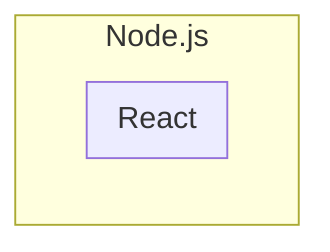
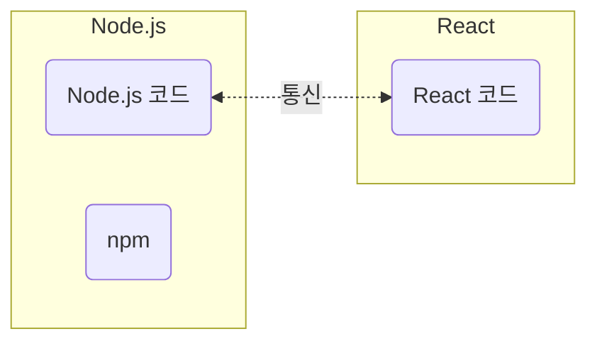
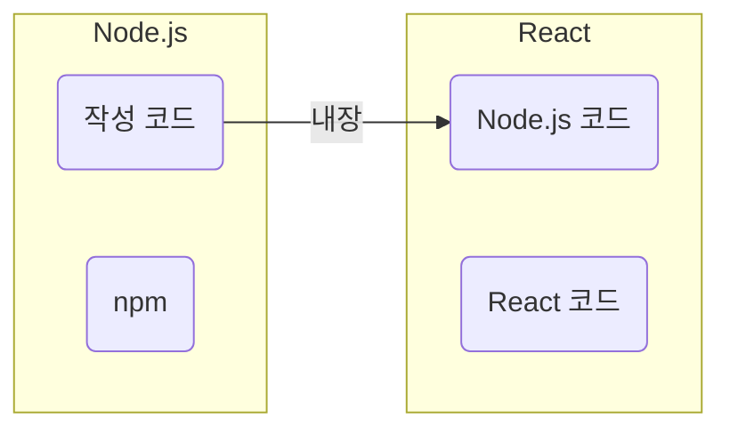
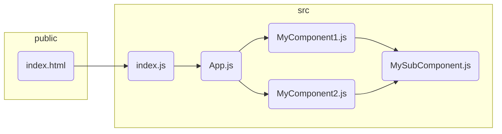

# 01-hello-react

## # 코드

[React_test](https://github.com/oyunojino/React_test.git)

## # 서론

| Tools   | Description                                                                         |
| ------- | ----------------------------------------------------------------------------------- |
| Angular | 2.0으로 업데이트 후 학습곡선이 많이 높아짐                                          |
| React   | React Native 이용하면 React 방식으로 안드로이드용 JAVA 코드와 iOS Swift로 변경 가능 |
| Vue.js  | jQuery의 가장 근접한 스타일로 학습곡선이 낮음                                       |
| Svelte  | 가장 최근에 나온 프레임워크로 아직 인지도가 낮음                                    |

### 1. React 구성

- React는 Node.js의 내장 백엔드를 기반으로 동작
- Node.js는 자바스크립트를 사용하는 모든 것에 사용 가능
- SCSS를 기본으로 사용함

### 2-1. 기존 개발 방식

### 2-2. 요즘 개발 방식

### 3-1. 컴포넌트

재사용 가능한 HTML 조각 단위

### 3-2. 클래스 컴포넌트

- React 오리지널 컴포넌트
- class 형태로 정의하는 컴포넌트
- 함수형 컴포넌트보다 구문이 복잡하고 길다.
- 함수형 컴포넌트보다 구문이 좀 더 명확하다.
- 클래스 안에 통칭 LifeCycle이라는 미리 정해지 함수들을 통해 화면의 갱신 시점이나 변수값의 변경 시점에 화면을어떻게 처리할지 정의할 수 있다.

### 3-3. 함수형 컴포넌트(권장)

- 클래스 컴포넌트보다 구문이 간결하지만 그만큼 더 난해할 수 있다.
- 리액트 버전 16이후에 LifeCycle을 처리할 수 있는 Hook이라는 기능이 도입되면서 React에서 공식적으로 권장하는 컴포넌트 작성 방법

### 4. 프레임워크 vs 라이브러리

| 프레임워크                                       | 라이브러리                                                                |
| ------------------------------------------------ | ------------------------------------------------------------------------- |
| 코딩틀이 정해진 상황에서 규칙에 맞게 수정하는 툴 | 함수 같은 것을 불러와서 내가 직접 수정하는 유틸리티 개념                  |
|                                                  | 철저하게 화면 구현에만 관여하기 때문에 페이스북에서 라이브러리라고 소개함 |
|                                                  | 즉, 자체적으로 제공해주는건 많이 없지만 서드파티 라이브러리를 통해 제공함 |

### 5. 깃허브 연동하기

|     | Description | Code                                  |
| --- | ----------- | ------------------------------------- |
| 1   | 브렌치 생성 | `git branch -M main`                  |
| 2   | 저장소 지정 | `git remote add origin "저장소 주소"` |
| 3   | pull 받기   | `git pull origin main`                |
| 4   | 코멘트 작성 |
| 5   | 커밋        |
| 6   | push 하기   |

## # 개발환경 구성

### 1. Node.js

| OS     | 방법                                                 |
| ------ | ---------------------------------------------------- |
| Window | 1. 명령프롬프트 실행 : `winKey` + ` R` → cmd `enter` |
|        | 2. 명령어 수행 : `node --version`                    |
| MacOs  | 1. 터미널 실행 : `Cmd` + `Space` → terminal `enter`  |
|        | 2. 명령어 수행 : `node --version`                    |

-> 버전값이 출력되지 않는 경우 수동 설치 필요

1. [Node.js](https://nodejs.org/en) 에서 프로그램을 내려받아 설치(LTS 버전 권장)
   → Mac M1 버전의 경우 17 이상 버전 필요
2. 설치 완료 후 명령프롬프트 or 터미널 종료하고 재시작
3. 앞서 수행한 버전 확인 명령어를 통해 설치 완료 확인

### 2. 의존성 관리도구

#### npm

- 의존성 관리 도구
- 플러그인 자동 다운로드
- 처리효율이 떨어짐

#### yarn

- facebook에서 개발
- 터미널(혹은 명령프롬프트)를 열고 아래의 명령어를 통해 설치 수행.
- 반드시 Node.js가 설치된 상태에서 진행해야함  
  `npm install -g yarn`
- 설치 실패한 경우
  | OS | 방법 |
  | ------- | ------------------------------------------------- |
  | Windows | 직접 설치 파일을 내려받아 오프라인 설치 진행 |
  | Mac OS | homebrew를 사용하여 설치 수행 `brew install yarn` |

### 3. IDE

#### Visual Studio Code 확장자

| 이름                      | 개발자            | 설명                                                |
| ------------------------- | ----------------- | --------------------------------------------------- |
| Color Highlight           | Sergii Naumov     | 색상 코드 값을 실제 그 색상으로 강조한다.           |
| ESLint                    | Microsoft         | 자바스크립트 구문 검사 기능                         |
|                           |                   | 터미널에서 npm install -g eslint 수행 필요          |
|                           |                   | 단, React에서 권장하지 않음                         |
| Image preview             | Kiss Tamas        | 이미지 파일을 소스코드 줄번호 엽에 미리보기 표시함  |
| npm Intellisense          | Christian Kohler  | import 할 모듈의 이름이나 경로에 대한 자동완성 제공 |
| Prettier - Code formatter | Prettier          | 코드의 줄바꿈, 들여쓰기드을 자동으로 정렬한다.      |
|                           |                   | 사용방법 ctrl + shift + p → format document         |
| vscode-styled-components  | Styled Components | JS 구문안에서 사용될 SCSS 구문을 인식               |

## # 프로젝트 실행하기

- 프로젝트 생성 및 초기화

1. 폴더 위치로 이동 `cd /d "폴더 경로 작성"`

   -> Window 한정 ) 해당 위치로 이동후 주소창에 cmd 입력하면 이동 완료

2. 프로젝트 이름은 영어 소문자만 사용 가능
3. 프로젝트 초기화

| 대상     | 작업내용                                                                        |
| -------- | ------------------------------------------------------------------------------- |
| src 폴더 | App.css, App.test.js index.css, logo.svg, setupTest.js, reportWebVitals.js 삭제 |
| App.js   | App.css, logo.svg에 대한 참조(import) 구문 제거                                 |
| index.js | ndex.css와 reportWebVitals.js에 대한 참조(import) 구문 제거                     |
|          | 맨 마지막 행에 있는 reportWebVitals() 부분 삭제                                 |
|          | `<React.StrictMode>` 태그 삭제                                                  |

## # 프로젝트 코드 구조

- 다른 JS 컴포넌트를 import(참조)하여 내가 리턴하는 JSX 코드 안에서 재사용하여 DOM 구조를 구성

#### 상대 경로 지정 시,

| 프로그램 언어 | 상대 경로                                    |
| ------------- | -------------------------------------------- |
| Java          | ./A.png = A.png                              |
|               | 즉, `./` 가 없어도 `같은 패키지 내`에서 찾음 |
| React         | ./A.png ≠ A.png                              |
|               | 즉, 가 없다면 `node-modules` 에서 찾음       |
